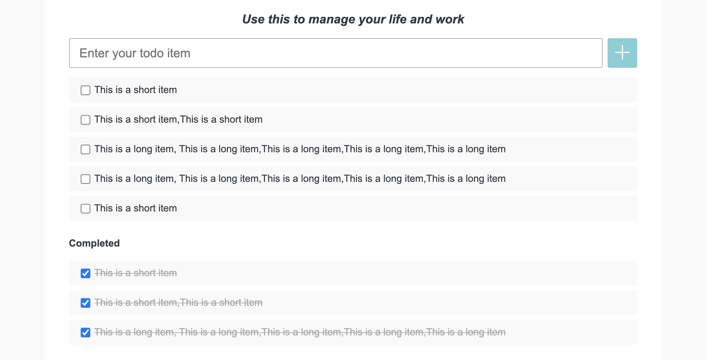
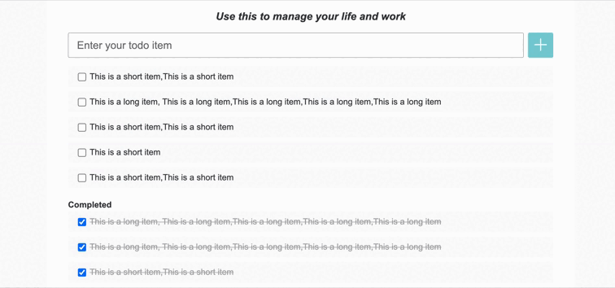

## 前端环境准备

### 下载依赖

```bash
npm install
```

### 运行网站

请执行如下代码运行网站并打开页面：

```bash
npm start
```
之后在浏览器中访问：http://localhost:3000

### 启动 Json Server

```
npm run server
```
启动 json server 后可以，可以使用以下 API
- 获取 tasks 数据:
```
  URL: 'http://localhost:8080/tasks'
  Method: GET
  Response status: 200
  Response body 示例: [{id: 1, name: 'xx', completed: false}, {id: 2, name: 'xx', completed: false}]
```
- 创建 task:
```
  URL: 'http://localhost:8080/tasks'
  Method: POST
  Request body 示例: {name: 'xx', completed: false}
  Response status: 201
  Response body 示例: {id: 1, name: 'xx', completed: false}
```
- 删除指定 id 的 task:
```
  URL: 'http://localhost:8080/tasks/${id}'
  Method: DELETE,
  Response status: 200
  Response body 示例: {}
```
- 修改指定 id 的 task:
```
  URL: 'http://localhost:8080/tasks/${id}'
  Method: PUT,
  Request body 示例: {name: 'xx', completed: false}
  Response status: 200
  Response body 示例: {id: 1, name: 'xx', completed: false}
```

## 技术实现要求
- React
    - 使用 React
    - 组件内部状态管理使用 React Hooks
    - 全局状态管理库使用 Context + useReducer hooks
- TDD
    - 编码开始前，介绍 Tasking 结果
    - 遵守 TDD Cycle：Red -> Green -> Refactoring
    - 遵守 The 3 Laws of TDD
    - 小步提交
    - 遵循
        - 核心业务需求的实现采用： UI integration Test Drive Development
        - 业务细节的实现采用： Unit / Component Test Drive Development
        - 重构出来的代码： 按需加上单元测试
- CSS 样式的要求优先级最低，编码时，可调用[_style.scss](src/styles/_style.scss)，使用对应的class
- 布局效果[overall.png](document/overall.png)

**现在是学习阶段，我们是在“刻意练习”。不管要实现的需求或任务有多么简单，请按照上述要求实现需求。**

### Story 1 显示 Item 列表

作为一个用户，我应当能看到已经添加过的 Item。包括 TODO 列表和 Completed 列表。  
若 Items 较多，则会出现纵向滚动条。 效果如下：


### Story 2 添加 Item

作为一个用户，我应当能够添加 Item。这样我就可以创建待办事项列表了。

#### AC 1 添加 Item

* 我应当能够在输入框（就是 Enter you todo item 那个输入框）中输入 TODO item 的内容（内容为纯文本）。
* 当我输入完毕之后，点击 “+” 按钮就可以在 TODO item 列表中添加一个新的 item，且它的文本应该和我输入的文本一致。
* 当新的 item 添加完毕之后，应当清空输入框中的文字。

#### AC 2 避免开头和结尾的空格

* 当我输入的文本含有开头和结尾的空白字符的时候，在添加过程中应当去掉这些空白字符。例如我输入 “  Good  ”，则最终添加的内容应当是 “Good”。空白字符以 `String.prototype.trim` 的默认情况为准。

#### AC 3 错误检查

* 当我输入的文本为空文本时，或我输入的文本全部为空白字符的时候。应当显示一个错误消息：“Please input something first.”
* 错误消息的应当在 Enter your todo item 下方。
* 但是当我成功的添加了一个 Item 之后，错误信息应当消失。



### Story 3 修改 Item 内容

作为一个用户，我可以修改已经创建的 Item 内容。

#### AC 1 编辑完成

* 当鼠标点击 Item 内容区域，显示 input 输入框，自动focus，placeholder 为当前内容，用户可以输入新的内容，按 "回车键"，修改成功，显示新的内容，输入框消失。

#### AC 1 取消编辑

* 当鼠标点击 Item 内容区域，显示 input 输入框，自动focus，点击其他地方，输入框消失，原来 Item 内容不变。


